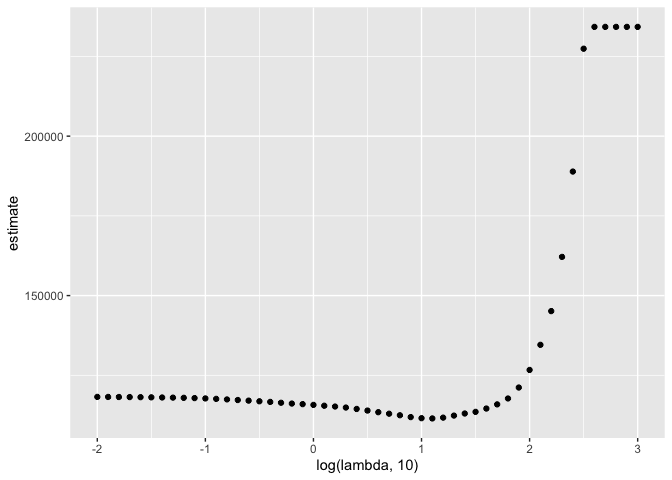

Statistical Learning
================
Dionna Attinson
11/26/2019

## Predictive Modeling Using Lasso

To illustrate the lasso, we’ll data from a study of factors that affect
birthweight. The code chunk below loads and cleans these data, converts
to factors where appropriate, and takes a sample of size 200 from the
result.

``` r
bwt_df = 
  read_csv("./extra_topic_data/birthweight.csv") %>% 
  janitor::clean_names() %>%
  mutate(
    babysex = as.factor(babysex),
    babysex = fct_recode(babysex, "male" = "1", "female" = "2"),
    frace = as.factor(frace),
    frace = fct_recode(frace, "white" = "1", "black" = "2", "asian" = "3", 
                       "puerto rican" = "4", "other" = "8"),
    malform = as.logical(malform),
    mrace = as.factor(mrace),
    mrace = fct_recode(mrace, "white" = "1", "black" = "2", "asian" = "3", 
                       "puerto rican" = "4")) %>% 
  sample_n(200)
```

    ## Parsed with column specification:
    ## cols(
    ##   .default = col_double()
    ## )

    ## See spec(...) for full column specifications.

To fit a lasso model, we’ll use `glmnet`. This package is widely used
and broadly useful, but predates the tidyverse by a long time. The
interface asks for an outcome vector y and a matrix of predictors X,
which are created next. To create a predictor matrix that includes
relevant dummy variables based on factors, we’re using model.matrix and
excluding the intercept

``` r
x = model.matrix(bwt ~ ., bwt_df)[,-1]
y = bwt_df$bwt

lasso_fit = glmnet(x,y)
```

We fit the lasso model for each tuning parameter in a pre-defined grid
lambda, and then compare the fits using cross validation. I chose this
grid using the trusty “try things until it looks right” method; glmnet
will pick something reasonable by default if you prefer that. lambda min
identifies the exact value to minimize prediction error.

``` r
lambda = 10^(seq(3, -2, -0.1))

lasso_fit =
  glmnet(x, y, lambda = lambda)

lasso_cv =
  cv.glmnet(x, y, lambda = lambda)

lambda_opt = lasso_cv$lambda.min
```

The plot below shows coefficient estimates corresponding to a subset of
the predictors in the dataset – these are predictors that have non-zero
coefficients for at least one tuning parameter value in the pre-defined
grid. As lambda increases, the coefficient values are shrunk to zero and
the model becomes more sparse. The optimal tuning parameter, determined
using cross validation, is shown by a vertical blue line.

``` r
broom::tidy(lasso_fit) %>% 
  select(term, lambda, estimate) %>% 
  complete(term, lambda, fill = list(estimate = 0) ) %>% 
  filter(term != "(Intercept)") %>% 
  ggplot(aes(x = log(lambda, 10), y = estimate, group = term, color = term)) + 
  geom_path() + 
  geom_vline(xintercept = log(lambda_opt, 10), color = "blue", size = 1.2) +
  theme(legend.position = "bottom")
```

<!-- -->

The next plot shows the CV curve itself. This is relatively shallow –
having nothing at all in your model isn’t great, but you can get
reasonable predictions from models that have “too many” predictors. If
you didn’t care about signficance and just wanted to be able to predict
models with the best accuracy this would work the best. Could tell you
prediction of risk (i.e., who is at risk for suicide ideation)

``` r
broom::tidy(lasso_cv) %>% 
  ggplot(aes(x = log(lambda, 10), y = estimate)) + 
  geom_point()
```

<!-- -->

``` r
lasso_fit = 
  glmnet(x, y, lambda = lambda_opt)

lasso_fit %>% broom::tidy()
```

    ## # A tibble: 12 x 5
    ##    term               step  estimate lambda dev.ratio
    ##    <chr>             <dbl>     <dbl>  <dbl>     <dbl>
    ##  1 (Intercept)           1 -3659.      12.6     0.627
    ##  2 babysexfemale         1    46.2     12.6     0.627
    ##  3 bhead                 1    77.9     12.6     0.627
    ##  4 blength               1    71.8     12.6     0.627
    ##  5 fincome               1     0.252   12.6     0.627
    ##  6 gaweeks               1    23.1     12.6     0.627
    ##  7 malformTRUE           1   447.      12.6     0.627
    ##  8 menarche              1   -29.4     12.6     0.627
    ##  9 mraceblack            1  -105.      12.6     0.627
    ## 10 mracepuerto rican     1  -145.      12.6     0.627
    ## 11 smoken                1    -2.62    12.6     0.627
    ## 12 wtgain                1     2.32    12.6     0.627

## Pokemon Example using Clustering

Works best with numeric variables, not categorical. For ther first
clustering example, we’ll use a dataset containing information about
pokemon. The full dataset contains several variables (including some
that aren’t numeric, which is a challenge for clustering we won’t
address). To make results easy to visualize, we look only at hp and
speed; a scatterplot is below.

``` r
poke_df = 
  read_csv("./extra_topic_data/pokemon.csv") %>% 
  janitor::clean_names() %>% 
  select(hp, speed)
```

    ## Parsed with column specification:
    ## cols(
    ##   `#` = col_double(),
    ##   Name = col_character(),
    ##   `Type 1` = col_character(),
    ##   `Type 2` = col_character(),
    ##   Total = col_double(),
    ##   HP = col_double(),
    ##   Attack = col_double(),
    ##   Defense = col_double(),
    ##   `Sp. Atk` = col_double(),
    ##   `Sp. Def` = col_double(),
    ##   Speed = col_double(),
    ##   Generation = col_double(),
    ##   Legendary = col_logical()
    ## )

``` r
poke_df %>% 
  ggplot(aes(x = hp, y = speed)) + 
  geom_point()
```

<!-- -->

K-means clustering is established enough that it’s implemented in the
base R stats package in the kmeans function. This also has a bit of an
outdated interface, but there you go. The code chunk below fits the
k-means algorithm with three clusters to the data shown above.

``` r
kmeans_fit =
  kmeans(x = poke_df, centers = 3)
```

More recent tools allow interactions with the `kmeans` output. In
particular, we’ll use `broom::augment` to add cluster assignments to the
data, and plot the results.

``` r
poke_df =
  broom::augment(kmeans_fit, poke_df)

poke_df %>% 
  ggplot(aes(x = hp, y = speed, color = .cluster)) +
  geom_point()
```

<!-- -->

Clusters broadly interpretable, but this still doesn’t come with
inference. Also, at boundaries between clusters, the distinctions can
seem a bit … arbitrary.

The code chunk below maps across a few choices for the number of
clusters, and then plots the results.

``` r
clusts =
  tibble(k = 2:4) %>%
  mutate(
    km_fit =    map(k, ~kmeans(poke_df, .x)),
    augmented = map(km_fit, ~broom::augment(.x, poke_df))
  )

clusts %>% 
  select(-km_fit) %>% 
  unnest(augmented) %>% 
  ggplot(aes(hp, speed, color = .cluster)) +
  geom_point(aes(color = .cluster)) +
  facet_grid(~k)
```

<!-- -->

## Clustering Trajectories

``` r
traj_data = 
  read_csv("./extra_topic_data/trajectories.csv")
```

    ## Parsed with column specification:
    ## cols(
    ##   subj = col_double(),
    ##   week = col_double(),
    ##   value = col_double()
    ## )

``` r
traj_data %>% 
  ggplot(aes(x = week, y = value, group = subj)) + 
  geom_point() + 
  geom_path()
```

<!-- -->
Next we’ll do some data manipulation. These steps compute the SLRs,
extract estimates, and format the data for k-means clustering. Need to
go from long to wide format so that it is suitable for formatting.

``` r
int_slope_df = 
  traj_data %>% 
  nest(data = week:value) %>% 
  mutate(
    models = map(data, ~lm(value ~ week, data = .x)),
    result = map(models, broom::tidy)
  ) %>% 
  select(-data, -models) %>% 
  unnest(result) %>% 
  select(subj, term, estimate) %>% 
  pivot_wider(
    names_from = term,
    values_from = estimate
  ) %>% 
  rename(int = "(Intercept)", slope = week)
```

A plot of the intercepts and slopes are below. There does seem to be
some structure, and we’ll use k-means clustering to try to make that
concrete.

``` r
int_slope_df %>% 
  ggplot(aes(x = int, y = slope)) + 
  geom_point()
```

<!-- -->

Do I have two groups? What do they look like?

``` r
km_fit = 
  kmeans(
    x = int_slope_df %>% select(-subj) %>% scale, 
    centers = 2)

int_slope_df =
  broom::augment(km_fit, int_slope_df)
```

The plot below shows the results of k-means based on the intercepts and
slopes. This is … not bad, but honestly maybe not what I’d hoped for.

``` r
int_slope_df %>% 
  ggplot(aes(x = int, y = slope, color = .cluster)) +
  geom_point()
```

<!-- -->

You can then predict who is mre likely to be in what cluster, for exampe
who is more likely to to have a steeper disease trajectory.

``` r
left_join(traj_data,int_slope_df) %>% 
  ggplot(aes(x = week, y = value, group = subj, color = .cluster)) +
  geom_point() + 
  geom_path()
```

    ## Joining, by = "subj"

<!-- -->
